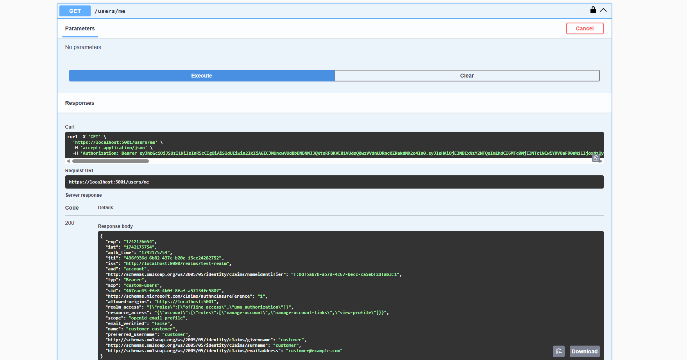

# keycloak-example
Example of how to use Keycloak with a MSSQL database powering the User Storage Provider. Also changes the login theme and wires up to an .NET (Core) API.

## Requirements
- Install Docker. https://www.docker.com/
- Install .NET 9 SDK. https://dotnet.microsoft.com/en-us/download/dotnet/9.0
- Install Java 21. https://adoptium.net/temurin/releases/
- Install Maven 3.9.9. https://maven.apache.org/download.cgi
- Install pnpm 10.6.3. https://pnpm.io/installation

The versions may not need to be exactly those. Simply outlining the versions used as the time of creating this proof of concept.

## Build
- Build Keycloak User Storage Provider extension.
    - Open a terminal in `keycloak-extension/custom-user-provider` and run `maven clean package`.
    - This extension will use a backing MSSQL database to determine if a login was successful or not. This is valuable because most companies have their own database tables with user credentials already. A Keycloak User Storage Provider extension will utilize that data to authenticate and generate OAuth2 tokens for them.
- Build custom Keycloak container.
    - Open a terminal in `keycloak-extension/` and run `docker build -t keycloak-override:latest .`.
    - This custom Keycloak container is so we're able to package the Keycloak User Storage Provider extension's JAR and a custom banana login theme with Keycloak. These are enabled in the test-realm located at `src/AppHost.AppHost/test-realm.json`.
- Build .NET Solution.
    - Open a terminal in `src/` and run `dotnet build`.
- Run AppHost.AppHost.
    - This is a .NET project that orchestrates running multiple applications and containers at the same time. 

# How does it work?
Order of Operations:
1. MSSQL container will be created.
2. DatabaseInitialization tool will run and populate MSSQL database with a single user. 
    - `Username: customer`
    - `Password: password`
3. Keycloak container will be created.
    - The realm, custom User Storage Provider, and theme are created using the `src/AppHost.AppHost/test-realm.json` file. In other words everything is already setup for you.
4. Api will be created.

During this whole process the .NET Aspire dashboard should be available to you. After the Api is stood up and everything is in the Running status we can perform some tests.

1. Click on the `https://localhost:5001` endpoint to navigate to the Api's Swagger page.

2. Click `Authorize` in the top right of the page.
    - Set the client_id as `custom-users`.
    - Click `select-all` to enable every scope.
    - Click `Authorize` again.

3. This will take you to Keycloak's OAuth2 login page. However, it will be banana themed. The theme has been setup in `keycloak-extension/themes/banana/login/`.
    - Enter the credentials:
        - `Username: customer`
        - `Password: password`
    - Click `Sign In`.

8. This will navigate you back to the Swagger page and display your authentication information.

9. Click on `/users/me` and click `Execute` to verify authorization is working when making API requests.

## I want to learn. Where do I look?

- Keycloak Admin: Click on `http://localhost:8080`. The login is:
    - `Username: admin`
    - `Password: password`
- Keycloak Login Theme: `keycloak-extension/themes/banana`
- Keycloak User Storage Provider backed by MSSQL Data: `keycloak-extension/custom-user-provider/src/main/java/org/keycloak/examples/storage/user`
- Creating Keycloak container: `src/AppHost.AppHost/Program.cs`
- Creating MSSQL container: `src/AppHost.AppHost/Program.cs`
- Database Initialization: `src/DatabaseInitialization/Program.cs`
- .NET API with authentication setup: `src/Api/Program.cs.`